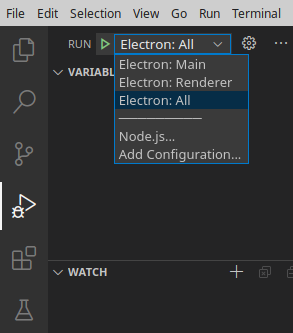

# JEM: Joystick Enhanced Mapping

JEM (Joystick and Controller Enhanced Mapping) is an advanced tool designed to provide comprehensive mapping and customization for virtual controllers. It aims to replace existing applications by offering a more robust and flexible solution for joystick and controller enthusiasts. JEM allows users to create complex mappings, macros, and profiles for their controllers, enhancing their gaming and simulation experiences.

## Features

- Advanced joystick and controller mapping
- Customizable macros and profiles
- Support for multiple controllers
- Real-time feedback and adjustments
- User-friendly interface

## Prerequisites

Ensure you have the following installed on your development machine:

- Node.js (v22.5.1 or later)
- npm (comes with Node.js)
- Electron (v31.3.1 or later)
- TypeScript (v5.5.4 or later)
- Visual Studio Code (v1.92.0 or later)
- Cursor AI (for enhanced code assistance)

## Install Application

## Clone repository

```sh
git clone https://github.com/miket-llc/jem.git
```

## Change into directory

```sh
cd jem
```

## Install dependencies

```sh
npm install
```

## Optional: test if the application is running

```sh
npm start
```

## Set Up Visual Studio Code and Start Debugging

1. Open the `jem` folder in Visual Studio Code.
2. Set a breakpoint in `src/main/main.ts` and `src/renderer/index.tsx`.
3. In the Run view, select the "Electron: All" configuration.

    This is a compound configuration that will start both the "Electron: Main" and "Electron: Renderer" configurations.

    

4. Click the green arrow next to the "Electron: All" configuration, or run the "Run" -> "Start Debugging" command (`F5`).
    - The breakpoint in `main.ts` will be hit.
    - Click Continue (`F5`).
    - In the Electron example app, interact with the joystick or controller to trigger the breakpoints in `index.tsx`.

## Project Structure

```plaintext
project-root/
│
├── src/
│   ├── common/
│   │   └── logLevels.ts
│   ├── main/
│   │   ├── services/
│   │   │   └── logger.ts
│   │   └── main.ts
│   │   └── preload.ts
│   ├── renderer/
│   │   ├── services/
│   │   │   └── ipcService.ts
│   │   ├── index.tsx
│   │   └── renderer.html
│
├── build/
├── .vscode/
│   └── launch.json
├── package.json
├── tsconfig.json
└── webpack.config.js
```

## Using Cursor AI

Cursor AI can be used to enhance your development experience by providing intelligent code suggestions and assistance. Ensure you have Cursor AI installed and configured in your Visual Studio Code environment.

## Contributing

Contributions are welcome! Please open an issue or submit a pull request with your changes. For detailed setup and development tips, see [CONTRIBUTING.md](CONTRIBUTING.md).

## License

This project is licensed under the MIT License.
